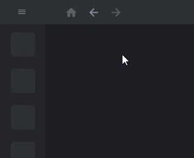

# freelens-cluster-sidebar

An always-on cluster full-name panel for FreeLens' Hotbar.

[日本語](README.md)

FreeLens' Hotbar (the vertical icon strip on the left edge) can only show a cluster name as a 2-3 character abbreviation.
Once you have more than a handful of clusters registered, the abbreviation alone is not enough to tell clusters apart, which risks operating on the wrong one.

This is a known, long-standing gap in the FreeLens/Lens community that remains unresolved upstream, e.g. [lensapp/lens#7333](https://github.com/lensapp/lens/issues/7333) and [lensapp/lens#3498](https://github.com/lensapp/lens/issues/3498).
No existing extension or npm package was found that addresses it.

`freelens-cluster-sidebar` adds a hover-expanding panel over the Hotbar that lists every cluster registered in the Catalog by its full name, with a connection-status indicator and a highlight for the active cluster.
See [docs/design.md](docs/design.md) for the full design rationale, including what this extension deliberately does not do (reordering, grouping, adding clusters — the existing Hotbar/Catalog screens already own those).

## Compatibility

Requires FreeLens 1.8.0 or later (see `engines` in package.json).
Verified on FreeLens 1.10.3 (Extension API 1.10.3, Windows x64).

## Install

1. Download the latest `.tgz` from [GitHub Releases](https://github.com/AvapCoLtd/freelens-cluster-sidebar/releases)
2. Drag & drop it onto the Extensions screen in FreeLens
3. To update, repeat the same steps with the new `.tgz`

## Usage

1. The whole Hotbar area (the vertical icon strip on the left edge) acts as the hover trigger, excluding the TopBar at the top and the Hotbar switch menu at the bottom
2. Hovering the Hotbar instantly expands the panel, listing every cluster registered in the Catalog by its full name
   - Each row shows a connection-status LED (green = connected, yellow = connecting/disconnecting, gray = disconnected) and highlights the currently active cluster
3. Moving the mouse away from the panel instantly collapses it again
4. Clicking a cluster name in the list navigates to that cluster's overview page (the same behavior as clicking it in the Hotbar)

> [!NOTE]
> Keeping FreeLens' "Automatically hide hotbar" setting OFF is recommended.
> The whole Hotbar area is the hover trigger for this panel, so with auto-hide enabled the panel may open unintentionally during menu operations.

Reordering, grouping, and adding new clusters are out of scope, to avoid duplicating the Hotbar's and Catalog screen's existing responsibilities.

## Links

- https://github.com/AvapCoLtd/freelens-cluster-sidebar (public)
- https://gitlab.avaper.day/avap/freelens-plugins/freelens-cluster-sidebar (development)

Development: see [CONTRIBUTING.md](CONTRIBUTING.en.md).

## License

MIT
